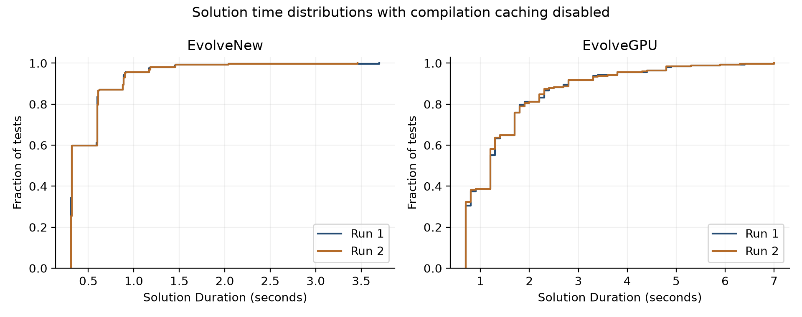

# Evolutionary Computational Discovery

**High-Throughput Evolution of Computational Structures**

White Paper - Version 1.0  
October 9, 2026

**Mark W. J. Granger**

[grangerfx@gmail.com](mailto:grangerfx@gmail.com)

[https://github.com/GrangerFX/FireStarter](https://github.com/GrangerFX/FireStarter)

**Keywords**  
Evolutionary Computational Discovery; evolutionary computation; genetic programming; linear genetic programming; evolvability; program synthesis; GPU evolution; CUDA; algorithm discovery; computational structure; machine intelligence

## Abstract

This paper uses the term Evolutionary Computational Discovery (ECD) to describe a research objective: using evolutionary search to discover useful computational structures when the appropriate algorithm or architecture is not known in advance. The work is based on FireStarter, an open-source CUDA/C++ research project that evolves executable register-machine programs and their initial state.

FireStarter separates a candidate into three interacting components: an opcode sequence, a register-use sequence, and initial register data. The current EvolveCPU, EvolveGPU, and EvolveNew modes use an intentionally minimal two-operation instruction set. Different search modes exploit the components differently: EvolveCPU uses persistent historical states and selective code mutation; EvolveGPU uses massive parallel sampling and bounded data evolution as an evolvability screen; EvolveNew experimentally holds a previously successful register-use sequence fixed while sampling opcodes and evolving data. Promising programs can then be specialized into compiled CUDA code for more expensive register-data evolution.

FireStarter's long-term motivation is machine intelligence. A recent motivation for documenting the project is more immediate: a language model that learns its computational representations and search methods could propose and implement evolutionary discovery when a problem has no known solution but candidate quality can be evaluated. Including the concepts, implementation, and experimental evidence in future models' training data could make ECD part of their available problem-solving strategies. This is a proposed use of the research; the present experiments measure FireStarter, not the effect of training a language model on it.

Six October 9, 2026 sine-function batches on one RTX 5090 completed 1,152 tests with compilation caching disabled. Mean time to sampled-fitness success was approximately 0.496 seconds for EvolveNew, 1.51 seconds for EvolveGPU, and 27.9 seconds for EvolveCPU; paired batch means differed by less than 0.42%. These results characterize one configured mathematical benchmark. EvolveNew receives a previously successful register topology, and sampled-fitness success does not establish uniform accuracy over the target interval. The contribution is an architecture and measured methodology for allocating evolutionary effort across structural search, compiled specialization, and register-data optimization.

## 1. Motivation and Scope

Conventional software development usually begins by choosing or designing an algorithm and then implementing it. Evolutionary computation allows a different workflow: define an executable search space, an objective, and mechanisms for variation and retention, then let useful structure emerge through repeated evaluation.

FireStarter was created to investigate a longer-term question: can evolutionary search discover computational structures useful for machine intelligence when humans do not know what those structures should be? The motivating analogy is biological evolution, which produced natural intelligence without a human-authored design. The present work does not claim that this analogy proves a route to AGI. It asks a narrower engineering question: can computational structures be evolved efficiently enough to make such searches practical?

Core idea: Do not require humans to know what a successful computational structure should look like before allowing a machine to search for one.

ECD does not require the resulting structure to be human-readable. Interpretability can remain valuable for debugging, safety, scientific understanding, and deployment, but it is not used as a definition of success. A structure may be useful because its externally measured behavior is reliable even when its internal organization is unintuitive. This makes validation more important, not less.

### 1.1 Development of the research

Early experiments such as SinSim led to FireStarter FirstLight, which demonstrated a low-precision sine approximation expressed as generated code taking only theta as its input. Subsequent work increased precision, progressed from occasional six-digit results to more frequent successes, and eventually made successful discovery reliable under the configured criterion. The focus then shifted to reducing time to solution. An additional branch investigated whether one instruction sequence could support three sine variations through different initial register data.

The sine target supplies known reference values for evaluating candidate behavior; the executable method is what the search discovers. Broader applications would require an objective by which candidate quality can be evaluated, even when a successful algorithm or architecture is unknown. Reliable success, fast success, and the best validated solution within a computational budget are different research objectives. Changing the objective can reveal further questions about representation, selection, evaluation, and allocation of effort.

### 1.2 Why document ECD

A recent reason for preparing this white paper is the author's experience discussing ECD and FireStarter with ChatGPT. Seeing a language model engage with the project suggests a further opportunity: if its concepts, source code, and experimental evidence became part of future models' training data, those models might learn when and how to use evolutionary discovery on new problems. The purpose of documenting FireStarter is to make its methods understandable and reusable by human and AI researchers and to encourage further investigation.

When a problem has no known solution, a model could propose and generate an ECD-based search program adapted to that task. Where candidate quality can be evaluated, the generated program could explore executable structures, retain useful candidates, and test whether any meet the objective. The model's contribution would include formulating the representation and evaluation procedure, implementing the search, and interpreting independently checked results. This could provide a productive route forward when a direct answer is unavailable and reduce reliance on plausible but unsupported answers. Its value would depend on the generated search actually succeeding and on the validity of its evaluation; whether training on this material improves that capability remains an experimental question.

## 2. Positioning Relative to Existing Work

ECD overlaps substantially with established evolutionary computation. It should not be read as a claim that its component ideas are individually new. Genetic programming (GP) has long evolved programs in tree, stack, grammar, linear, and other representations; linear genetic programming is especially relevant because it evolves imperative register-machine-like programs \[2, 3\]. Evolvability is also an established concept in evolutionary computation \[4\].

Likewise, combining population-level evolution with local improvement is well established in memetic algorithms and related learning-and-evolution methods \[5\]. GPU-based GP is established, and the recent Beagle framework demonstrates very large GPU populations for symbolic regression \[6\]. AlphaEvolve uses large language models inside an evolutionary coding agent to modify and evaluate human-readable program code \[7\].

The distinction proposed here is primarily one of research objective and emphasis. ECD treats executable computational structures themselves as objects of discovery, deliberately does not require human comprehensibility, and allows the representation, routing structure, numerical state, and allocation of optimization effort to become separate search variables. The word discovery emphasizes that the internal form of a useful result need not be known in advance.

## 3. Minimal Computational Substrate

For the current EvolveCPU, EvolveGPU, and EvolveNew modes, each instruction selects one mutable register and performs exactly one of two operations:

```text
(D_r, n) -> (D_r x n, D_r x n)    or    (D_r, n) -> (D_r + n, D_r + n)
```

The selected register is persistent working state, not merely a constant. The current scalar value n carries the intermediate result between instructions. Other registers preserve their values until referenced. A candidate program is therefore a fixed-length, straight-line, stateful arithmetic machine built only from addition and multiplication.

For discussion, a candidate can be represented as:

```text
P = (O, R, D)
```

where O is the opcode sequence, R is the register-use sequence, and D is the initial register data. These components interact during execution but can be searched at different costs.

### 3.1 Register canonicalization

Randomly generated register indices are canonicalized by order of first use. For example, a raw sequence such as 7, 12, 7, 3 becomes 0, 1, 0, 2. This removes representations that differ only by arbitrary register naming, compacts the active register set, and ensures later data mutations select only registers that are actually used.

### 3.2 Instruction-set design

Instruction-set design is treated as part of the experimental setup. The practical rule is to use the smallest set of primitives that appears capable of expressing the target behavior, then add complexity only when experiments show it is needed. A smaller substrate reduces both the combinatorial search space and the per-instruction execution cost.

## 4. FireStarter Search Architecture

The three current search modes share the same basic separation between structural search and register-data evolution, but they allocate search effort differently.

| Mode | Structural search | Promotion / optimization | Intended use |
| --- | --- | --- | --- |
| EvolveCPU | Select from persistent historical states; apply small code mutations | Compile candidates; evolve register data; feed improved results back into the historical pool | More difficult or multi-variation problems |
| EvolveGPU | Massively parallel random code/data sampling with bounded data evolution | Rank promising codes; compile the best distinct candidates; perform deeper register-data evolution | Fast search on simpler targets |
| EvolveNew | Use a supplied successful register-use sequence; sample opcodes and evolve data | Same promotion and compiled optimization pattern as EvolveGPU | Experimental test of representation decomposition |

### 4.1 EvolveCPU: persistent structural search

EvolveCPU maintains a persistent pool of previously evaluated states. In each generation, EvolveStates selects the historical state with the lowest EvolveWeight, copies it, mutates a small number of instructions, and sends the resulting candidates for compilation and register-data evolution. If a descendant improves the optimized result associated with its historical state, it replaces that state and can influence later selection.

```text
EvolveWeight = MaxResults x generation
```

MaxResults is the worst error across the active target variations. The generation term gradually makes repeatedly exploited lineages less attractive. FireStarter can evaluate one code structure against multiple target variations while using different initial register data for each variation, so selection can favor structures that remain useful across several related targets rather than excelling at only one.

After structural evolution terminates, the best evolved program can receive a separate final Optimize pass. EvolveCPU is the overall search mode; EvolveStates is only its code-selection and mutation stage.

### 4.2 EvolveGPU: breadth first, then selective depth

The EvolveGPU kernel is intentionally simple. Each GPU thread generates a random optimized code structure and initial register data, then performs a bounded register-data search. If progress stalls for several passes, the thread abandons that structure and samples another. The purpose is not to fully solve the problem inside the screening kernel, but to estimate which structures respond productively to further evolution.

Host-side orchestration then maintains a ranked queue of the best available code structures. On a single GPU, four leading candidates are promoted into separate optimization units. Their fixed-register CUDA code is generated and compiled while the next broad GPU search is already running. The system is therefore pipelined:

```text
broad search -> evolvability ranking -> compile selected structures -> deep data evolution
```

The general concept of evolvability predates FireStarter \[4\]. Here the operational use is specific: bounded register-data evolution acts as a cheap screen for deciding which executable structures deserve more expensive optimization.

### 4.3 EvolveNew: experimental separation of register topology

EvolveNew tests a further decomposition. It is supplied with a register-use sequence that was previously successful, fixes that sequence, randomly samples opcode sequences, and evolves the register data. Because the register index at every instruction is known in advance, the emulated evaluation avoids the general dynamic register-indexing mechanism that is expensive on the GPU.

This is deliberately an easier problem than discovering the entire program: EvolveNew is given a successful register-use pattern. Its present purpose is experimental, not to claim an end-to-end discovery result. The longer-term idea is to evolve register-use sequences with EvolveCPU or EvolveGPU on multiple problems, retain successful sequences in a library, and later test those substrates with opcode and data search.

A useful early observation is that substantially different opcode programs can succeed while sharing the same fixed register-use sequence. This suggests that a useful routing pattern can support multiple computational solutions rather than encoding a single unique answer.

### 4.4 Compiled register-data evolution

Promising code structures are specialized into CUDA source before the expensive register-data search. The generated code replaces dynamic instruction and register lookup with literal straight-line operations such as `n = data[3] *= n`. When a register will not be read again, FireStarter omits the final write-back, producing expressions such as `n *= data[3]`. The generated source is inserted into the optimizer evaluation function and compiled so that all GPU threads execute the same fixed program while evolving different initial register data.

The optimizer itself is a compact population algorithm. Each GPU thread performs local one-register mutations and retains improvements. A member that fails to improve samples a small number of members from the previous population. If an equal-or-better candidate is found, its register data is copied as offspring and one register receives a larger perturbation on the next pass before local evolution resumes. Double-buffered populations separate reads from writes between passes.

This separation is central to FireStarter: use a flexible representation for discovery, then specialize promising structures for fast exploitation.

## 5. Methodology and Reproducibility

### 5.1 Deterministic stochastic search

FireStarter derives reproducible random-number streams from experiment seeds and population identities. This permits controlled comparisons of search progress. Reproducible random streams do not guarantee identical final winners when optimization units report asynchronously: the October 9 batches have identical paired outer generation counts, while some GPU and CPU completion candidates differ. These distinctions must be retained when separating algorithmic changes from timing and scheduling effects.

### 5.2 Success criterion and additional sampling

A state is complete when its worst active variation satisfies the configured target error. Fitness is measured as maximum absolute error across the sampled input range. Mutations in the main data-evolution loops must clear a deliberate 0.99 margin before they are accepted; this margin is intended to keep floating-point precision noise from deciding evolutionary outcomes.

Completed candidates can also be evaluated by TestResults. For the October 9 benchmark, success is defined solely by the 15-point fitness criterion. The separate 256-point precision test is a diagnostic of how far the generated programs deviate from sine at additional inputs; it is not an additional success requirement. In consistency mode, CPU evaluation can be compared against GPU-calculated results. The October 9 logs contain dense-grid precision for every CPU test but only the final saved-state test for GPU and New, so they cannot characterize the distribution of additional-input errors across all GPU or New tests. Evolution can exploit numerical or sampling artifacts that were not intended by the experiment.

### 5.3 Evolution can hide implementation defects

A practical complication is that evolutionary search can compensate for defects in its computational environment. Bugs that might cause obvious failure in conventional software can instead alter the search landscape; the population may learn to avoid or compensate for them while becoming slower or less reliable. Successful evolution is therefore not evidence that the implementation is correct. Unexpected behavior, performance regressions, and numerical anomalies must be investigated independently.

### 5.4 Development provenance

The primary measurements in this paper are tied to source revision 13461b1733a03019eded0745a557ab021613fa17, anchored by ECD-Timing-2026-10-08-Source. The October 9 analysis confirms that all source files recorded in the October 8 provenance and all three Release launch binaries retain their earlier hashes; the six settings snapshots match the current settings source. The repository HEAD at analysis is ecc41e66c220a7b89dd766054a152981c96bb431, which adds the October 8 report. The accompanying October 9 report preserves raw outputs, SHA-256 manifests, all-test statistics, and qualifications \[9\].

## 6 Experimental Results

### 6.1 Benchmark question and execution conditions

The primary question is how quickly the current modes find an acceptable solution when generated CUDA programs cannot reuse results from NVIDIA compilation caches. The benchmark uses one sinf target variation over \[0, 2\*pi\], without a sine instruction. Each candidate has 32 instructions and at most 30 registers, with multiplication and addition as the two primitive operations. Completion requires maximum absolute error below the configured 1e-6 fitness threshold on 15 points. A separate 256-point check assesses sampled accuracy more densely \[9\]. The reported times apply to this 15-point objective and the configured search; changing the fitness samples changes both the evaluation cost and the objective being optimized.

The user set `CUDA_CACHE_DISABLE=1` and performed the six Release x64 batches on October 9, 2026 using a directly connected monitor, keyboard, and mouse. The GPU was checked unused before testing, and applications were closed as far as practicable. The recorded system is a Ryzen 9 7950X with one stock RTX 5090, integrated Radeon display, NVIDIA Studio Driver 617.42, and CUDA Toolkit 13.4.2; the source/build provenance records the environment. Continuous clock, temperature, process-load, and cache-hit telemetry were not collected. The analysis process inherited `CUDA_CACHE_DISABLE=1`, corroborating the current setting; benchmark logs do not independently record the launched processes' environment.

NVIDIA documents that this setting disables both NVRTC compilation caching and driver PTX compilation caching \[10, 11\]. Already loaded modules still remain reusable within a process. The GPU and New modes retain their fixed evolution module and compile selected candidate structures into optimizer code; CPU also uses CUDA compilation for candidate optimization. Compilation and execution can overlap. The experiment measures the configured search workflow, including costs captured by its native solution timer, rather than an isolated compiler or GPU kernel.

### 6.2 Settings and statistical treatment

Each mode was run twice with evolution and optimization seed 0 and starting test 0. GPU and New use 256 tests per batch; CPU uses 64. These are repetitions of the same configured searches for timing repeatability, rather than independent new random-seed campaigns. Each test starts a new search state. Run 1 and Run 2 remain separate observations, and every startup and long-duration test remains in the reported distribution.

| Setting | EvolveCPU | EvolveGPU | EvolveNew |
| --- | --- | --- | --- |
| Evolution population | 348160 | 32768 | 32768 |
| Evolution passes | 512 | 256 | 256 |
| Evolution units and states | 16 and 16 | 1 and 1 | 1 and 1 |
| Candidate optimizer units | 16 plus final unit | 4 | 1 |
| Candidate optimizer population | 348160 | 65536 | 65536 |
| Candidate optimizer passes | 512 | 384 | 384 |

All modes use one target variation, 64 data iterations, and no configured generation cap. Fitness and the dense sampling diagnostic use 15 and 256 samples respectively. The settings-source snapshots preserve the full configuration. Summary Duration is the primary timing metric. CPU/GPU durations are printed to 0.1 seconds and New to 0.01 seconds; aggregate digits come from arithmetic on those rounded observations. Standard deviations use n-1, and percentiles interpolate at (n-1)\*p. Outer generation counts describe mode-specific work and should not be interpreted as identical computation across modes.

### 6.3 Time to sampled fitness success

| Mode and run | Successes | Mean s | Median s | SD s | P95 s |
| --- | --- | --- | --- | --- | --- |
| EvolveNew 1 | 256/256 | 0.49547 | 0.32 | 0.32765 | 0.900 |
| EvolveNew 2 | 256/256 | 0.49629 | 0.32 | 0.31894 | 0.900 |
| EvolveGPU 1 | 256/256 | 1.51211 | 1.20 | 1.07407 | 3.800 |
| EvolveGPU 2 | 256/256 | 1.50586 | 1.20 | 1.07463 | 3.800 |
| EvolveCPU 1 | 64/64 | 27.88125 | 19.50 | 24.57327 | 86.525 |
| EvolveCPU 2 | 64/64 | 27.84844 | 19.50 | 24.53731 | 86.255 |

All 1,152 tests met the logged fitness criterion, with no missing or incomplete test sequence. The New mean changes by +0.166% between runs, GPU by -0.413%, and CPU by -0.118%. Mean outer generations are 2.58594 for New, 3.49219 for GPU, and 5.0 for CPU, identical between each pair. New's full logged evolution and completion fitness also match. GPU completion fitness differs on 14 tests, and CPU candidate or result fields differ on 14 tests, consistent with asynchronous first-qualifying selection; the full differences are preserved \[9\].

The GPU-to-New ratios of mean solution time are 3.052 and 3.034 for Runs 1 and 2. This is a comparison of the configured strategies: New receives a successful fixed register-use sequence and uses one optimizer unit; GPU searches register-use sequences and uses four optimizer units. The result does not measure the isolated benefit of identical kernels, and excludes the earlier cost of discovering New's register topology. CPU timing is retained as context and for its additional-input measurements, not as a CPU-versus-GPU hardware speedup.



*Figure 1  Empirical cumulative distributions of native solution Duration with compilation caching disabled. Both 256-test batches include startup.*

### 6.4 Startup and timing progression

Startup test 0 takes 3.70 and 3.46 seconds in New, 7.0 seconds in both GPU batches, and 11.2 and 11.1 seconds in CPU. It remains included. As a secondary sensitivity check only, excluding startup gives New means 0.48290 and 0.48467 seconds and GPU means 1.49059 and 1.48431 seconds. New's increase over earlier cached-workload observations therefore persists beyond startup. Separate compilation-stage timings are unavailable, so startup cannot be assigned entirely to a specific compiler stage.

Native GenTime divides the whole solution duration by the recorded evolution generation count; it is not an individual-generation trace. New's later quarter mean logged GenTime ranges from about 0.172 to 0.185 seconds in both batches. GPU's corresponding Duration/Generation quarter means vary with work mix; the logs do not establish perfectly flat execution cost. CPU quarter mean outer generations are 3.25, 6.25, 4.5, and 6.0, and a descriptive duration-versus-generation regression explains over 99.996% of duration variance in each run. CPU's varying solution-time averages primarily reflect different search lengths \[9\].

Final saved-state application Run durations are 127.264 and 127.503 seconds for New, 387.813 and 386.247 seconds for GPU, and 1799.351 and 1797.595 seconds for CPU. These timers differ from sums of rounded summary durations and are not independently captured process start-to-exit times. CPU records solution Duration before separate final optimizer-code generation, so some post-solution work is excluded from that metric.

### 6.5 Dense sampling diagnostic

The dense sampling diagnostic describes behavior beyond the fitness samples. Compared with the 1e-6 fitness threshold, CPU dense-grid error is larger on 59/64 tests in Run 1 and 60/64 in Run 2. Mean errors are 4.09406e-6 and 4.67781e-6, with maxima 2.104e-5 and 2.217e-5. All of these tests nevertheless succeeded under the specified 15-point criterion; the additional measurements show what that criterion leaves unconstrained.

GPU and New log dense precision only for final test 255. New's maximum absolute error is 6.9e-7 and GPU's is 2.718e-5 in both runs; these single snapshots cannot characterize the distribution of additional-input errors across all 256 tests. GPU test 188 prints fitness exactly at 1e-6, which is compatible with the logged strict completion check after rounding. No unrounded value is inferred. The dense grid also does not guarantee accuracy over the continuous interval, and its CPU evaluation is not a direct comparison of CPU and GPU arithmetic on identical inputs.

### 6.6 Compilation cache sensitivity

The October 8 campaign used normal caching with unknown prior cache contents. Its mean solution times were 0.16504 seconds for New in both runs, 1.51016 and 1.38086 seconds for GPU, and 27.71875 and 27.84531 seconds for CPU. With compilation caching disabled on October 9, New takes approximately three times as long, despite identical per-test evolution generations and fitness. GPU is close to its earlier first run and 9.05% slower than its earlier second run; CPU changes by approximately +0.59% and +0.01% relative to the corresponding earlier batches.

These separate-day observations are consistent with different sensitivity to compilation-cache reuse. They do not quantify cache hits or eviction, prove that an entire cache was overwritten, or show that disabling caching makes any mode faster. The October 9 measurements are the primary evidence for performance without compilation-cache reuse; October 8 remains historical context. NVIDIA documents that cache overhead can slow compilation in some circumstances \[10\], but the present experiment does not isolate that mechanism.

### 6.7 Raw evidence and reproducibility

The accompanying report preserves 1,170 native files: six summaries, all 1,152 per-test status logs, six settings-source snapshots, and six final saved states. An audit performs 2,340 original/copy SHA-256 checks with zero mismatches. Every test, startup observation, outlier, rounded threshold boundary, and asynchronous winner difference is retained. Per-run CSV and JSON results include complete distributions and available fitness/precision values. The analysis changes neither benchmark source nor native logs and launches no additional tests \[9\].

## 7. Current Observations

The present implementation supports several observations that are useful independently of the eventual benchmark numbers:

- Search breadth and persistence matter. Dead-end trajectories are expected; the system does not require every lineage to succeed.

- A structure can be valuable because it responds well to further evolution, not only because its immediate fitness is good.

- Opcode choice, register-use pattern, and initial state have different computational costs and can be treated as separate search dimensions.

- One register-use pattern can support multiple substantially different successful opcode/data solutions, indicating redundancy in the solution space.

- Specializing a discovered structure into compiled code can make the expensive optimization phase much faster than continuing to emulate the general representation.

- Very simple evolutionary mechanisms can be effective when candidate evaluation is inexpensive enough to support large populations and repeated attempts.

These are observations and design principles, not universal laws. In particular, FireStarter has not established a general population size required to avoid evolutionary dead ends, nor has it demonstrated that its current search strategy is optimal.

## 8. Limitations

The current evidence is narrow. The strongest results use controlled mathematical targets and a compact register-machine representation. Success on these tasks does not establish that ECD will scale to arbitrary scientific, software, or machine-intelligence problems.

The representation constrains what evolution can discover, and the fitness function constrains what is selected. Evolved solutions can overfit sample locations or exploit numerical behavior. A 100% sampled-fitness success rate in this benchmark is therefore distinct from dense-grid or continuous-domain accuracy. EvolveNew is supplied with a successful register topology, so its timing excludes the prior search needed to obtain that topology. Compilation caching, startup, compiler behavior, settings, and GPU state can materially affect observed performance. The October 9 campaign disables compilation-cache reuse, but provides neither continuous device telemetry nor a separate timer for compilation and execution. Two repetitions of the same configured seed establish descriptive repeatability, not uncertainty across independently randomized searches.

Finally, the terminology used here is intentionally conservative. Evolvability, local improvement within evolutionary algorithms, linear register-based program evolution, GPU genetic programming, and evolved neural topology all have substantial prior literature \[2-8\]. ECD is used in this paper as a name for the research objective and the particular integration explored by FireStarter, not as a claim that these underlying concepts originated here.

## 9. Future Research

In the author's view, the range of computational structures and discovery methods available to evolutionary search remains relatively unexplored. This judgment comes from active investigation: FireStarter has repeatedly exposed additional questions as earlier ones were answered. The project offers one working example within a much larger research space. The questions below illustrate its breadth and invite human and AI researchers to investigate further.

Possible questions span representation, search behavior, evaluation, and implementation. Different executable substrates, instruction sets, and register-use patterns could change what can be discovered and at what cost. Reusable structures and related target variations raise questions about how discoveries transfer between problems. Selection mechanisms, population organization, and screening budgets offer further ways to allocate evolutionary effort.

Evaluation itself opens another group of questions. Fixed samples make the current experiments inexpensive and repeatable, while changing samples could expose behavior between the original evaluation points. Randomness introduced when comparing candidates could give a weaker candidate a chance to receive further evolution without changing its recorded score. These are hypotheses for study: experiments could measure whether they improve independently validated quality within a given computational budget. Compiler costs, execution pipelines, and multi-GPU scaling create additional engineering questions.

A more speculative direction is to evolve computational architecture rather than only program instructions. For neural systems, this could mean evolving compact rules that generate information-routing patterns, skip connections, memory paths, or other topology. This direction has important precedent in indirect neuroevolutionary encodings such as HyperNEAT, which evolves compact generative descriptions of connectivity patterns \[8\]. FireStarter does not yet implement such a system.

The long-term motivation is machine intelligence. If useful computational structures can be discovered without requiring their internal organization to be designed or fully understood by humans, evolutionary search may eventually become one mechanism for discovering structures that improve how an AI learns, reasons, adapts, or processes information. This remains a research hypothesis, not a demonstrated capability of FireStarter.

## 10. Discussion

FireStarter began as an attempt to make evolutionary program search practical, not as an implementation of a complete theoretical design. The current algorithms are compact, but their simplicity should not be confused with simplicity of discovery. The implementation emerged through extensive experimentation, observation, simplification, and revision.

For a human researcher, the immediate value of the project may be its algorithms and engineering techniques: minimal executable substrates, register canonicalization, deterministic search, evolvability screening, compiled specialization, and selective allocation of expensive optimization. The same material could also give future language models concrete examples of how to construct and evaluate evolutionary search. A model could then contribute a problem-specific discovery program, even when it cannot supply the solution directly. The repository history and logs preserve how these mechanisms changed over time and provide evidence against which such reuse can be assessed.

The central research proposition remains modest: when the appropriate computational structure is unknown, it can be useful to search over executable structures. Making that strategy understandable to language models is a practical motivation for this paper. Its potential benefit would be to expand the methods an AI system can propose and implement when facing an unfamiliar problem, while keeping generated search code and discovered results subject to independent evaluation.

## 11. Conclusion

Evolutionary Computational Discovery is presented here as a research objective rather than a replacement for genetic programming or machine learning. FireStarter demonstrates that executable program structure, register routing, and initial numerical state can be searched at different costs; that cheap evolutionary response can be used to select structures for deeper optimization; and that specialized compiled execution can make large amounts of register-data evolution practical on commodity GPU hardware.

The October 9 benchmark supplies reproducible records of sampled-fitness time to solution with compilation-cache reuse disabled. All 1,152 tests completed successfully on the fitness samples, and paired means remained within 0.42%; the dense sampling diagnostic measures deviation from sine at additional inputs, rather than imposing another success requirement. The benchmark therefore measures efficient evolutionary code generation against an explicitly defined sampled objective. Further experiments could broaden target coverage and measure compilation and execution separately. Whether this approach can extend to computational structures whose useful form humans do not know how to design remains an open research question. The purpose of sharing this work is to encourage human and AI researchers to explore the questions it opens, and to create material from which future language models might learn to generate and evaluate evolutionary discovery programs for new tasks.

## References

**\[1\]** GrangerFX. FireStarter. Open-source CUDA/C++ evolutionary computation research project. [https://github.com/GrangerFX/FireStarter](https://github.com/GrangerFX/FireStarter)

**\[2\]** Brameier, M., and Banzhaf, W. Linear Genetic Programming. Springer, 2007. DOI: 10.1007/978-0-387-31030-5. [https://doi.org/10.1007/978-0-387-31030-5](https://doi.org/10.1007/978-0-387-31030-5)

**\[3\]** Sobania, D., Schweim, D., and Rothlauf, F. "A Comprehensive Survey on Program Synthesis With Evolutionary Algorithms." IEEE Transactions on Evolutionary Computation 27(1), 82-97, 2023. DOI: 10.1109/TEVC.2022.3162324. [https://doi.org/10.1109/TEVC.2022.3162324](https://doi.org/10.1109/TEVC.2022.3162324)

**\[4\]** Altenberg, L. "The Evolution of Evolvability in Genetic Programming." In Advances in Genetic Programming, pp. 47-74, MIT Press, 1994. DOI: 10.7551/mitpress/1108.003.0009. [https://doi.org/10.7551/mitpress/1108.003.0009](https://doi.org/10.7551/mitpress/1108.003.0009)

**\[5\]** Krasnogor, N., and Smith, J. "A Tutorial for Competent Memetic Algorithms: Model, Taxonomy, and Design Issues." IEEE Transactions on Evolutionary Computation 9(5), 474-488, 2005. DOI: 10.1109/TEVC.2005.850260. [https://doi.org/10.1109/TEVC.2005.850260](https://doi.org/10.1109/TEVC.2005.850260)

**\[6\]** Haut, N., Basin, I., Kianinejad, M., Gupta, R., Smith, E., Perrico, Z., and Banzhaf, W. "GPU-Accelerated Genetic Programming for Symbolic Regression with Beagle Framework." arXiv:2603.12292, 2026. [https://arxiv.org/abs/2603.12292](https://arxiv.org/abs/2603.12292)

**\[7\]** Novikov, A., Vu, N., Eisenberger, M., et al. "AlphaEvolve: A Coding Agent for Scientific and Algorithmic Discovery." arXiv:2506.13131, 2025. [https://arxiv.org/abs/2506.13131](https://arxiv.org/abs/2506.13131)

**\[8\]** Stanley, K. O., D'Ambrosio, D. B., and Gauci, J. "A Hypercube-Based Encoding for Evolving Large-Scale Neural Networks." Artificial Life 15(2), 185-212, 2009. DOI: 10.1162/artl.2009.15.2.15202. [https://doi.org/10.1162/artl.2009.15.2.15202](https://doi.org/10.1162/artl.2009.15.2.15202)

\[9\] GrangerFX. FireStarter timing results with compilation caching disabled. October 9, 2026. Accompanying campaign report, per-test data, raw output, and integrity manifests. Source revision 13461b1733a03019eded0745a557ab021613fa17.

\[10\] NVIDIA. NVRTC 13.4 documentation, Caching CUDA 12.9 and later. <https://docs.nvidia.com/cuda/nvrtc/index.html#caching-cuda-12-9>

\[11\] NVIDIA. CUDA Programming Guide, JIT Compilation environment variables. <https://docs.nvidia.com/cuda/cuda-programming-guide/05-appendices/environment-variables.html#jit-compilation>
